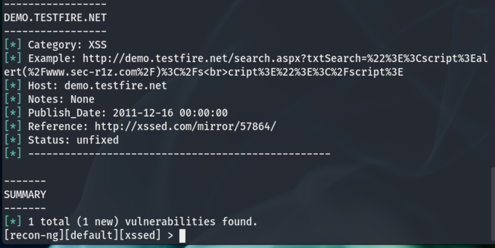

## Week 16 Homework Submission File: Penetration Testing 1

#### Step 1: Google Dorking

- Using Google, can you identify who the Chief Executive Officer of Altoro Mutual is:
  - Karl Fitzgerald

- How can this information be helpful to an attacker:
  - It can be used in phishing attempts.

#### Step 2: DNS and Domain Discovery

Enter the IP address for `demo.testfire.net` into Domain Dossier and answer the following questions based on the results:

  1. Where is the company located:
    - Sunnyvale, CA

  2. What is the NetRange IP address:
    - `65.61.137.64 - 65.61.137.127`

  3. What is the company they use to store their infrastructure:
    - Rackspace Backbone Engineering

  4. What is the IP address of the DNS server:
    - `65.61.137.117`

#### Step 3: Shodan

- What open ports and running services did Shodan find:
  - ports 80 and 8080 on Apache Tomcat/Coyote JSP engine

#### Step 4: Recon-ng

- Install the Recon module `xssed`.
- Set the source to `demo.testfire.net`.
- Run the module.

Is Altoro Mutual vulnerable to XSS:
  - Yes

  

### Step 5: Zenmap

Your client has asked that you help identify any vulnerabilities with their file-sharing server. Using the Metasploitable machine to act as your client's server, complete the following:

- Command for Zenmap to run a service scan against the Metasploitable machine:
  - `nmap -sV 192.168.0.10`

- Bonus command to output results into a new text file named `zenmapscan.txt`:
  - `nmap -sV -oN /root/Desktop/zenmapscan.txt 192.168.0.10`

- Zenmap vulnerability script command:
  - `nmap -sV --script smb-enum-* -p 139,445 192.168.0.10`
  

- Once you have identified this vulnerability, answer the following questions for your client:
  1. What is the vulnerability:
    - SMB is open and doesn't have any authentication requirements to access the server.

  2. Why is it dangerous:
    - anyone who has the IP address can login to the SMB share and upload malicious files or take any files that might help an attacker access more of the system.

  3. What mitigation strategies can you recommendations for the client to protect their server:
    - Add authentication requirements to access the SMB share server.
    - Make sure SMB is patched and updated.
    - Use more secure technologies to share information on a server and require a corporate VPN to access. 

---
© 2020 Trilogy Education Services, a 2U, Inc. brand. All Rights Reserved.  
