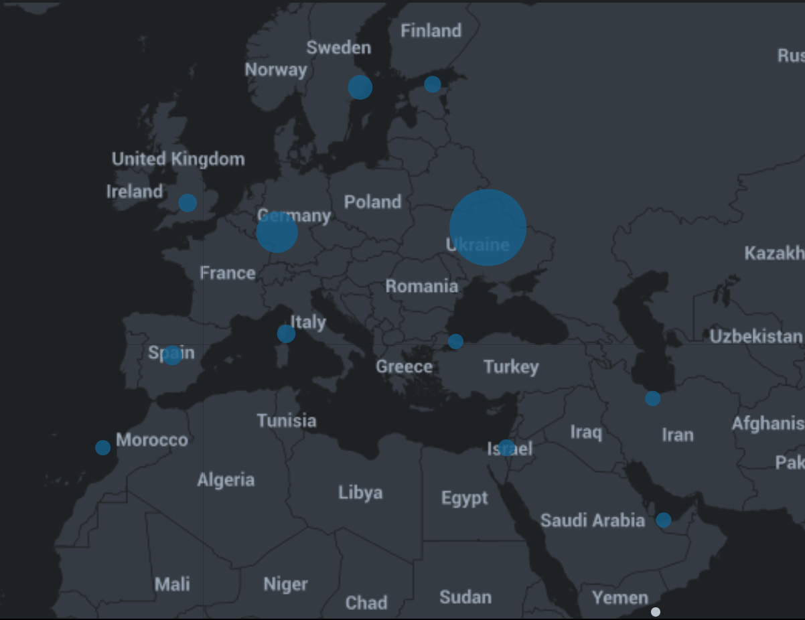

## Unit 19 Homework: Protecting VSI from Future Attacks

### Scenario

In the previous class,  you set up your SOC and monitored attacks from JobeCorp. Now, you will need to design mitigation strategies to protect VSI from future attacks.

You are tasked with using your findings from the Master of SOC activity to answer questions about mitigation strategies.

### System Requirements

You will be using the Splunk app located in the Ubuntu VM.

### Logs

Use the same log files you used during the Master of SOC activity:

- [Windows Logs](resources/windows_server_logs.csv)
- [Windows Attack Logs](resources/windows_server_attack_logs.csv)
- [Apache Webserver Logs](resources/apache_logs.txt	)
- [Apache Webserver Attack Logs](resources/apache_attack_logs.txt	)

---

### Part 1: Windows Server Attack

Note: This is a public-facing windows server that VSI employees access.

#### Question 1
- Several users were impacted during the attack on March 25th.
- Based on the attack signatures, what mitigations would you recommend to protect each user account? Provide global mitigations that the whole company can use and individual mitigations that are specific to each user.
  - ##### Global:
  - Firewall that prevents traffic from outside the US.
  - Notifications to users if a login attempt was made outside of their location.
  - corporate VPN when outside of the office to gain access to the company network.
  - ##### For individual users:
  - Raise security awareness and remind them of the dangers of clicking on unknown email links.
  - Use strong passwords!
  - Everyone should have MFA on their accounts so even if their password was compromised, it would be harder for an attacker to get in without the MFA code

#### Question 2
- VSI has insider information that JobeCorp attempted to target users by sending "Bad Logins" to lock out every user.
- What sort of mitigation could you use to protect against this?
  - Use different account names for accessing different systems. Don't use the corporate email as the login user name for everything, use only for email and a different name/password for everything else. Also make it a unique name so that an attacker can't guess the account name based on a name from an email address.

### Part 2: Apache Webserver Attack:

#### Question 1
- Based on the geographic map, recommend a firewall rule that the networking team should implement.
  - Block suspicious IPs from outside the US.
- Provide a "plain english" description of the rule.
  - For example: "Block all incoming HTTP traffic where the source IP comes from the city of Los Angeles."
  - Block all incoming HTTP traffic from the Ukraine.
- Provide a screen shot of the geographic map that justifies why you created this rule.

- 

#### Question 2

- VSI has insider information that JobeCorp will launch the same webserver attack but use a different IP each time in order to avoid being stopped by the rule you just created.

- What other rules can you create to protect VSI from attacks against your webserver?
  - Conceive of two more rules in "plain english".
  - Hint: Look for other fields that indicate the attacker.

### Guidelines for your Submission:

In a word document, provide the following:
- Answers for all questions.
- Screenshots where indicated

Submit your findings in BootCampSpot!

---

© 2020 Trilogy Education Services, a 2U, Inc. brand. All Rights Reserved.
